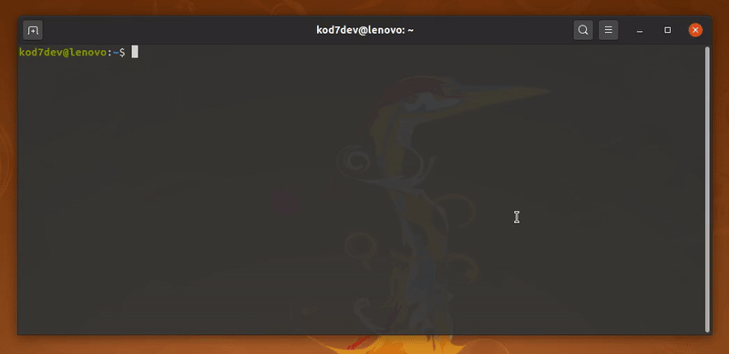
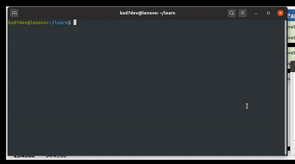

# Climan Laravel

[Laravel-Zero](https://laravel-zero.com) ile HTTP requestleri yapan basit CLI

## Installation

### Linux

(Bilgisayarda Git, NodeJS ve NPM, Composer kurulu olmalı)

Terminal/Komut Satırı açılır.

- `git clone https://github.com/kod7dev/TestFull.git` ile [TestFull](https://github.com/kod7dev/TestFull) indirilir.

- `git clone https://github.com/kod7dev/climan-laravel.git` ile climan-laravel indirilir.




**climan-laravel** için gerekli paketlerin kurulumu:

```
cd climan-laravel

composer install
```

**TestFull** için gerekli paketlerin kurulumu:

```
cd TestFull

npm install
```



İstekleri karşılayacak TestFull programını çalıştırmak için 

```
cd TestFull

node index.js
```

## Usage example

```
./climan-laravel get:users                  // tüm kullanıcıların bilgileri
./climan-laravel get:users 15                // id'si 15 olan kullanıcının bilgileri

./climan-laravel get:users 15 --posts        // id'si 15 olan kullanıcının tüm yazıları
./climan-laravel get:users 15 --postid=10    // id'si 15 olan kullanıcının postid'si 10 olan yazısı

./climan-laravel post:users                 // kullanıcı ekler

./climan-laravel put:users 15                // id'si 15 olan kullanıcıyı günceller.

./climan-laravel delete:users 15             // id'si 15 olan kullanıcıyı siler.

```

## API References

```
  _____ _ _                             _                           _ 
 / ____| (_)                           | |                         | |
| |    | |_ _ __ ___   __ _ _ __ ______| | __ _ _ __ __ ___   _____| |
| |    | | | '_ ` _ \ / _` | '_ \______| |/ _` | '__/ _` \ \ / / _ \ |
| |____| | | | | | | | (_| | | | |     | | (_| | | | (_| |\ V /  __/ |
 \_____|_|_|_| |_| |_|\__,_|_| |_|     |_|\__,_|_|  \__,_| \_/ \___|_|
                                                                      
                                                                      
  USAGE: ./climan-laravel <command> [options] [arguments]

  get:users    Bellli bir kullanıcıyı ya da tüm kullanıcıların bilgilerini listeler

  post:users   Kullanıcı ekler

  delete:users Kullanıcı siler

  put:users    Kullanıcı bilgilerini günceller

```

## Features

[] Kullanıcılara ait post silme
[] Kullanıcılara post ekleme

## Credit

[Güven Atbakan](https://github.com/shibby)

## License

MIT
